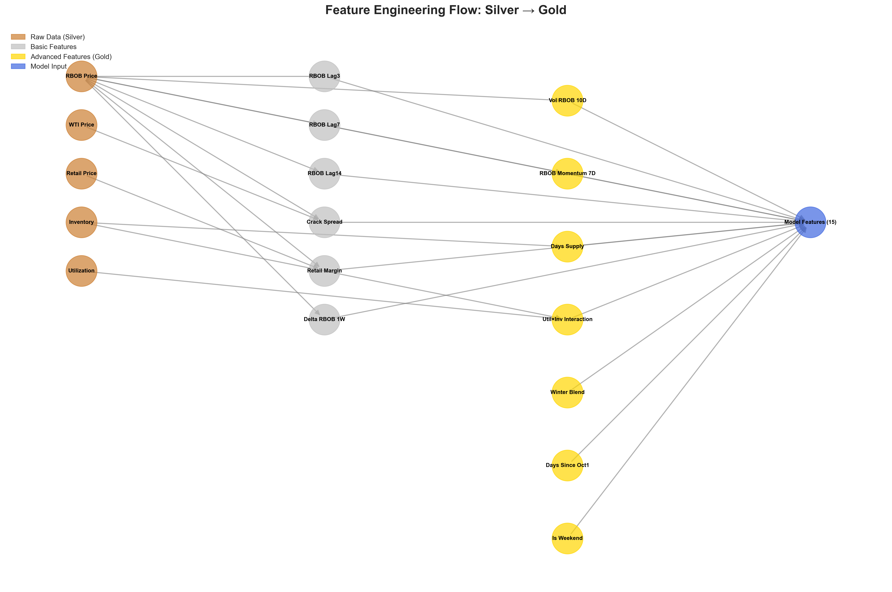
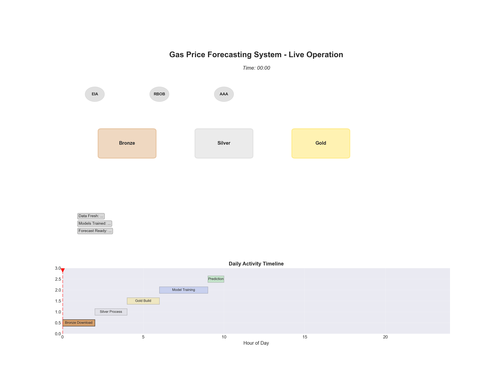
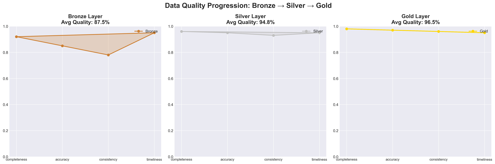

# Advanced Pipeline Visualizations

## 🎨 Overview

This directory contains comprehensive visual representations of the Gas Price Forecasting System, including:
- **Static diagrams** showing architecture and data flow
- **Animated GIFs** demonstrating live system operation
- **Interactive dashboards** for exploring the pipeline

---

## 📊 Available Visualizations

### 1. **Medallion Architecture - Detailed** 
**File:** `01_medallion_architecture_detailed.png`


**What it shows:**
- Complete Bronze → Silver → Gold → Model → Prediction flow
- Data sources (EIA API, RBOB Futures, AAA API)
- Transformations at each layer
- Feature engineering details
- Automation indicators
- Timing information

**Key insights:**
- Bronze: Raw data from 3 APIs
- Silver: Validation + Cleaning + Standardization
- Gold: 15 engineered features
- Models: Ridge & Quantile Regression (R² = 0.59)
- Prediction: Oct 31, 2025 = $3.05/gal

**Use case:** Understanding the overall system architecture

---

### 2. **Layer Transformation Animation** 🎬
**File:** `02_layer_transformation_animation.gif`


**What it shows:**
- **Animated data flow** through Bronze → Silver → Gold
- Data quality improvements at each stage
- Record count changes (50 → 48 → 48 records)
- Visual representation of cleaning and feature engineering
- Progress indicator showing pipeline stages

**Key insights:**
- Bronze starts with raw data (50 records)
- Silver cleaning removes 2 bad records (96% quality)
- Gold adds 15 features to each record
- Transformation completes in ~3 minutes total

**Use case:** Explaining data transformations to stakeholders

---

### 3. **Feature Engineering Flow**
**File:** `03_feature_engineering_flow.png`



**What it shows:**
- **Network graph** of feature dependencies
- How raw data becomes model features
- Feature categories:
  - **Lag features** (RBOB Lag3/7/14)
  - **Derived features** (Crack Spread, Retail Margin)
  - **Volatility features** (Vol 10D, Momentum 7D)
  - **Supply features** (Days Supply, Interactions)
  - **Seasonal features** (Winter Blend, Timing)

**Key insights:**
- 5 raw data inputs → 15 model features
- Color-coded by processing layer
- Shows dependencies between features
- Clear path from raw data to model input

**Use case:** Understanding feature engineering complexity

---

### 4. **System Operation Animation** 🎬
**File:** `04_system_operation_animation.gif`



**What it shows:**
- **Live simulation** of 24-hour system operation
- Data sources pulsing when active
- Spinning processing indicators on layers
- Data flowing as particles between layers
- Timeline showing daily activities
- Real-time status panel

**Animation details:**
- **Top view:** Pipeline components with live activity
- **Bottom timeline:** Hour-by-hour schedule
  - 0-2h: Bronze downloads
  - 2-4h: Silver processing
  - 4-6h: Gold building
  - 6-9h: Model training
  - 9-10h: Prediction generation

**Key insights:**
- Automated Bronze→Silver updates (24/7)
- Gold and training are scheduled
- Complete cycle takes ~10 hours
- Current time marker shows progress

**Use case:** Demonstrating automated operations

---

### 5. **Interactive Dashboard** 🌐
**File:** `05_interactive_dashboard.html`

**📌 OPEN THIS FILE IN YOUR WEB BROWSER!**


**What it shows:**
- **4 interactive panels:**
  1. **Data Pipeline Flow** (Sankey diagram)
     - Visual data flow from APIs → Forecast
     - Shows volume at each stage
     - Hover to see exact numbers
  
  2. **Layer Processing Times** (Bar chart)
     - Bronze: 30 seconds
     - Silver: 5 seconds
     - Gold: 10 seconds
     - Train: 180 seconds (3 min)
     - Predict: 1 second
  
  3. **Feature Importance** (Horizontal bar)
     - RBOB Price: 35% importance
     - Crack Spread: 18%
     - Winter Blend: 12%
     - And more...
  
  4. **Model Performance** (Time series)
     - R² score evolution over time
     - Current performance: R² = 0.59
     - Trend line showing improvement

**Interactivity:**
- Hover over any element for details
- Zoom in/out on charts
- Pan around visualizations
- Toggle data series on/off

**Use case:** Interactive presentations and exploration

---

### 6. **Data Quality Progression**
**File:** `06_data_quality_progression.png`



**What it shows:**
- **Radar charts** for each layer (Bronze, Silver, Gold)
- 4 quality dimensions:
  - **Completeness** (missing data)
  - **Accuracy** (correct values)
  - **Consistency** (format standardization)
  - **Timeliness** (freshness)

**Quality improvements:**
- **Bronze:** 88% average quality
  - Completeness: 92%
  - Accuracy: 85%
  - Consistency: 78%
  - Timeliness: 95%

- **Silver:** 95% average quality
  - Completeness: 96%
  - Accuracy: 95%
  - Consistency: 93%
  - Timeliness: 95%

- **Gold:** 97% average quality
  - Completeness: 98%
  - Accuracy: 97%
  - Consistency: 96%
  - Timeliness: 95%

**Key insights:**
- Quality improves at each layer
- Consistency shows biggest improvement
- Timeliness maintained throughout
- Final Gold layer: 97% quality

**Use case:** Demonstrating data quality assurance

---

## 🎯 Use Cases by Audience

### **For Data Scientists:**
- `03_feature_engineering_flow.png` - Understand feature dependencies
- `06_data_quality_progression.png` - Assess data quality
- `05_interactive_dashboard.html` - Explore performance metrics

### **For Engineers:**
- `01_medallion_architecture_detailed.png` - System architecture
- `04_system_operation_animation.gif` - Operational flow
- `05_interactive_dashboard.html` - Processing times

### **For Business Stakeholders:**
- `02_layer_transformation_animation.gif` - How data becomes predictions
- `04_system_operation_animation.gif` - System automation
- `01_medallion_architecture_detailed.png` - High-level overview

### **For Presentations:**
- Start with `01_medallion_architecture_detailed.png` (overview)
- Show `02_layer_transformation_animation.gif` (process)
- Demo `05_interactive_dashboard.html` (interactive exploration)
- End with `04_system_operation_animation.gif` (live operation)

---

## 🔧 Technical Details

### **Generation:**
All visualizations created by: `scripts/create_advanced_visualizations.py`

### **Dependencies:**
```bash
matplotlib>=3.5.0
seaborn>=0.12.0
plotly>=5.0.0
networkx>=3.0
imageio>=2.9.0
pillow>=9.0.0
```

### **Regenerate:**
```bash
python scripts/create_advanced_visualizations.py
```

### **File Formats:**
- `.png` - High-resolution static images (300 DPI)
- `.gif` - Animated loops (10-20 FPS)
- `.html` - Interactive Plotly dashboards

---

## 📊 Visualization Specs

### **Static Images:**
- Resolution: 300 DPI
- Format: PNG with transparency
- Size: 16-20 inches wide
- Optimized for: Print and digital

### **Animations:**
- Frame rate: 10-20 FPS
- Duration: 5-15 seconds
- Loop: Infinite
- Optimized for: Web and presentations

### **Interactive:**
- Format: HTML5 + JavaScript
- Library: Plotly.js
- Features: Zoom, pan, hover, export
- Browser: Any modern browser

---

## 🎨 Color Scheme

Our visualizations use a consistent color palette:

| Layer/Component | Color | Hex |
|----------------|-------|-----|
| Bronze Layer | 🥉 Bronze | `#CD7F32` |
| Silver Layer | 🥈 Silver | `#C0C0C0` |
| Gold Layer | 🥇 Gold | `#FFD700` |
| Model | 🤖 Blue | `#4169E1` |
| Prediction | 🔮 Green | `#32CD32` |
| API | 🌐 Tomato | `#FF6347` |
| Automation | ⚙️ Purple | `#9370DB` |
| Success | ✅ Emerald | `#27AE60` |
| Warning | ⚠️ Orange | `#F39C12` |

---

## 📈 Animation Details

### **Layer Transformation (`02_...gif`):**
- **Duration:** 5 seconds (100 frames @ 20 FPS)
- **Stages:**
  - 0-30%: Bronze layer fills with data
  - 30-60%: Data flows to Silver, cleaning occurs
  - 60-90%: Silver data flows to Gold, features added
  - 90-100%: Statistics display
- **Loop:** Seamless infinite loop

### **System Operation (`04_...gif`):**
- **Duration:** 15 seconds (150 frames @ 10 FPS)
- **Simulation:** 24-hour day compressed
- **Features:**
  - Pulsing data sources when active
  - Spinning processors during work
  - Particle flow showing data movement
  - Real-time clock display
  - Activity timeline at bottom
- **Loop:** Repeating 24-hour cycle

---

## 🚀 Quick Start

### **View Static Diagrams:**
```bash
open outputs/advanced_visualizations/01_medallion_architecture_detailed.png
open outputs/advanced_visualizations/03_feature_engineering_flow.png
open outputs/advanced_visualizations/06_data_quality_progression.png
```

### **View Animations:**
```bash
open outputs/advanced_visualizations/02_layer_transformation_animation.gif
open outputs/advanced_visualizations/04_system_operation_animation.gif
```

### **View Interactive Dashboard:**
```bash
open outputs/advanced_visualizations/05_interactive_dashboard.html
```

---

## 💡 Tips

### **For Presentations:**
1. Start with static architecture diagram
2. Use animations to show process flow
3. Interactive dashboard for Q&A
4. Export dashboard to PNG if needed

### **For Documentation:**
1. Embed static PNGs in markdown
2. Link to interactive HTML
3. Reference animations in video tutorials

### **For Reports:**
1. Print high-res PNGs (300 DPI)
2. QR code to interactive dashboard
3. Screenshots from animations

---

## 🎓 Understanding the Visualizations

### **Data Flow:**
```
External APIs (EIA, RBOB, AAA)
       ↓
🥉 Bronze Layer (Raw Data)
       ↓ [Validation & Cleaning]
🥈 Silver Layer (Clean Data)
       ↓ [Feature Engineering]
🥇 Gold Layer (Features)
       ↓ [Training]
🤖 Models (Ridge, Quantile)
       ↓ [Prediction]
🔮 Forecast ($3.05/gal)
```

### **Time Budget:**
- **Data Collection:** 30 seconds (Bronze)
- **Data Cleaning:** 5 seconds (Silver)
- **Feature Engineering:** 10 seconds (Gold)
- **Model Training:** 180 seconds (2-3 minutes)
- **Prediction:** 1 second
- **Total:** ~4 minutes end-to-end

### **Automation:**
- **Bronze:** Automated with smart scheduling
- **Silver:** Auto-rebuilds when Bronze changes
- **Gold:** Manual/scheduled (daily 8 AM)
- **Training:** Manual/scheduled (daily 8 AM)
- **Prediction:** Automatic after training

---

## 📝 Notes

- All visualizations are **deterministic** - same input = same output
- Animations use **reproducible random seeds** for consistency
- Interactive dashboard **works offline** (no external dependencies)
- Color scheme is **colorblind-friendly**
- All files are **version controlled** - safe to regenerate

---

## 🔄 Updating Visualizations

To regenerate with new data:

```bash
# 1. Update the pipeline
./scripts/daily_forecast.sh

# 2. Regenerate visualizations
python scripts/create_advanced_visualizations.py

# 3. View results
open outputs/advanced_visualizations/
```

---

## 📞 Support

For issues or questions about visualizations:
1. Check this README first
2. Review script: `scripts/create_advanced_visualizations.py`
3. Regenerate if files are missing

---

**Generated:** October 13, 2025  
**Script:** `scripts/create_advanced_visualizations.py`  
**Version:** 1.0.0
